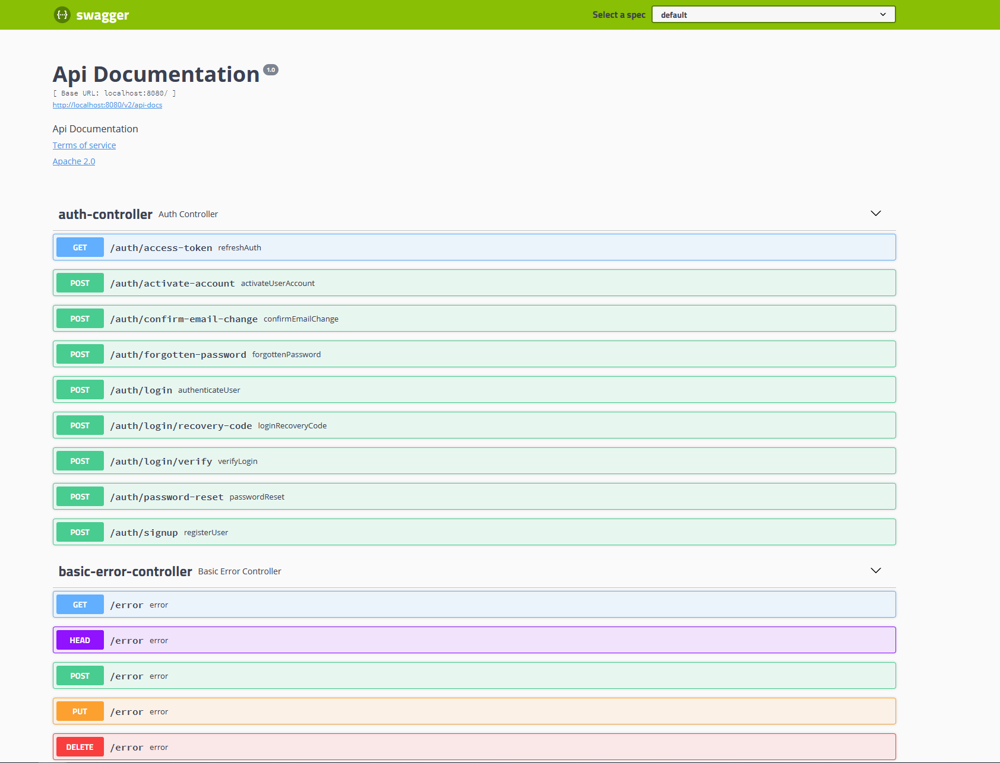

# Full-stack template - Spring boot 

 

Full-stack template is a React/Spring based template webapp that provides set of functionalities that are necessary for almost any web app. The code and all components were structured so that project is easy to test, maintain and expand.

This is a repository for the backend part written in Spring boot.

The Frontend can be found [HERE](https://github.com/Hasatori/fullstack-boilerplate-react-frontend)

Api documentation can be found at:  <a href="https://fullstack-template-spring.herokuapp.com/swagger-ui.html" target="_blank">fullstack-template-spring.herokuapp.com/swagger-ui.html</a>

## Installation

1) Package app `mvn clean install`
2) Start app `java -jar -Dspring.profiles.active=<active_profiles> <jar_name> `

## Configuration

Application can be configured via yml files that are stored at `src/main/resources`. There are tree configuration files:

* `application.yml` - common configuration for all environments
* `application-local.yml` - configuration for **_local_** environment
* `application-production.yml` - configuration for **_production_** environment

For security reasons sensitive information such as database username or O2 secrets are not exposed in the yml files but are set from system environment properties

| Property name           | Yml paths            |                              
| -----------             | -----------           |
| DATASOURCE_URL          | spring.datasource.url                                           
| DATASOURCE_USERNAME     | spring.datasource.username                                      
| DATASOURCE_PASSWORD     | spring.datasource.password                                      
| GOOGLE_CLIENT_ID        | spring.security.oauth2.client.registration.google.clientId             
| GOOGLE_CLIENT_SECRET    | spring.security.oauth2.client.registration.google.clientSecret         
| FACEBOOK_CLIENT_ID      | spring.security.oauth2.client.registration.facebook.clientId             
| FACEBOOK_CLIENT_SECRET  | spring.security.oauth2.client.registration.facebook.clientSecret         
| GITHUB_CLIENT_ID        | spring.security.oauth2.client.registration.github.clientId             
| GITHUB_CLIENT_SECRET    | spring.security.oauth2.client.registration.github.clientSecret         
| MAIL_SERVER_HOST        | spring.mail.host; spring.mail.properties.mail.smtp.ssl.trust        
| MAIL_SERVER_USERNAME    | spring.mail.username         
| MAIL_SERVER_PASSWORD    | spring.mail.password
| AUTH_TOKEN_SECRET       | app.auth.tokenSecret

## General supported functionalities
### User registration
  * username, email and password. Account has to be activated via email
  * O2 - Github, Google, Facebook
### User login
  * email + password
  * email + password + two-factor code. Two-factor can be set once user is logged in.
  * email + password + recovery code. In case two-factor code can not be used.
  * O2 authentication - Github, Google, Facebook
  * O2 authentication + two-factor. Two-factor can be set once user is logged in
### Forgotten password 
   * Password change request is sent by email
### Account management
  * profile picture, email, username update. If an email is updated the change has to be approved from the new email -
    otherwise, email will not be updated
  * password change
  * cancel account

## Spring specific supported functionalities

### Double JWT authentication

There are two tokens issues for each user. One refresh token and one access token. Access token lasts typically for few minutes and is sent with every request. It is user\`s one time key to resources. Refresh token lasts for much longer time (Can be a month but also a year). It is stored in a http-only cookie. When the access token expires client has to request a new access token via `/auth/access-token` endpoint. If the refresh token expires user is requested to log in.

Token\`s expiration can be set via properties `accessTokenExpirationMsec` and `refreshTokenExpirationMsec` that are in the yml config files.

### Localization 

Localization is done using [ResourceBundleMessageSource](https://docs.spring.io/spring-framework/docs/current/javadoc-api/org/springframework/context/support/ResourceBundleMessageSource.html) and localization properties files are stored at . 

For getting localized messages service  was created. The service considers request\`s locale preferences and loads messages accordingly. It is important for the frontend app that has also localization support.

